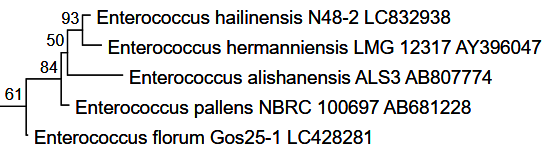
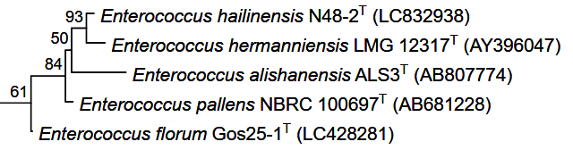

---

### 2. 英文文档：`README_en.md`
在同级目录下创建这个文件，专门面向需要英文文档的用户。

```markdown
[**🇨🇳 简体中文**](README.md)

# PhyloTidy-IJSEM

**A lightweight, drag-and-drop tool to automatically format phylogenetic tree SVG files for IJSEM publication standards.**

### 🌟 Introduction
When submitting novel species descriptions to journals like the *International Journal of Systematic and Evolutionary Microbiology (IJSEM)*, phylogenetic trees must adhere to strict formatting rules:
1. **Species names must be italicized.**
2. **Type strains must have a superscript 'T'.**
3. **Accession numbers must be enclosed in parentheses.**

Manually modifying SVG text one by one in Adobe Illustrator or Inkscape is both tedious and time-consuming. **PhyloTidy-IJSEM** uses regular expressions to parse and reformat the underlying text tags of your SVG automatically in seconds.

### 📸 Screenshots

| Before (Raw Export) | After (IJSEM Standard) |
| :---: | :---: |
|  |  |
| *Raw SVG export with standard formatting* | *Formatted ready for IJSEM submission* |

### ✨ Features
* **Zero Configuration:** Just drag and drop your SVG file(s) onto the `.exe` icon. No coding required.
* **Batch Processing:** Support processing multiple SVG files simultaneously.
* **Non-destructive:** Generates a new file with the `_Publication_Ready.svg` suffix, keeping your original file perfectly safe.
* **Highly Accurate:** Optimized specifically for standard 16S sequence headers downloaded directly from the LPSN database.

### 🚀 How to Use

#### 👉 For Windows Users (No installation required)
1. Go to the [Releases](../../releases) page and download the latest `PhyloTidy-IJSEM.exe`.
2. Locate the phylogenetic tree SVG file exported from your software (e.g., MEGA, iTOL).
3. **Drag and drop the `.svg` file directly onto the `PhyloTidy-IJSEM.exe` icon.**
4. A formatted file will automatically appear in the same folder.

#### 👉 For Developers (Run from source)
Ensure you have Python 3.x installed. No external libraries required.
```bash
# Clone the repository
git clone [https://github.com/zl-dotcom/PhyloTidy-IJSEM.git](https://github.com/zl-dotcom/PhyloTidy-IJSEM.git)

# Run the script (supports multiple files)
python format_svg.py your_tree_file.svg
